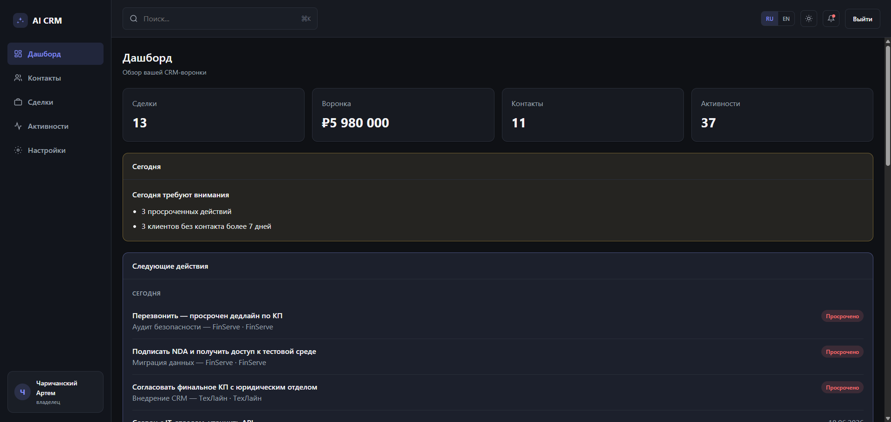
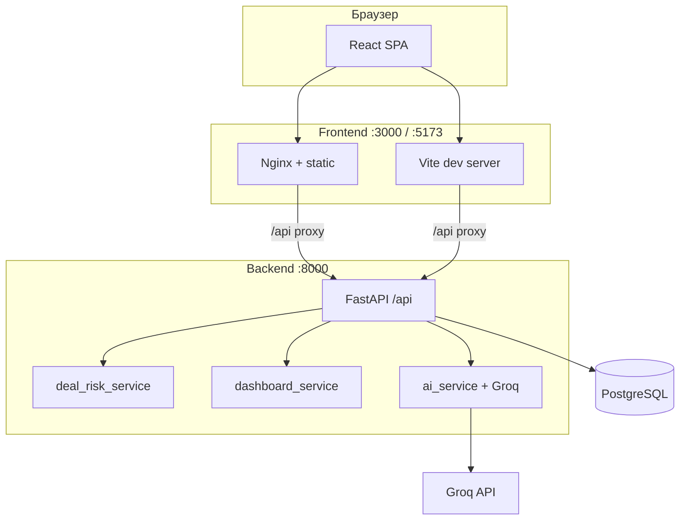
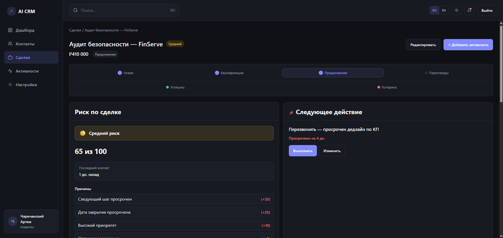
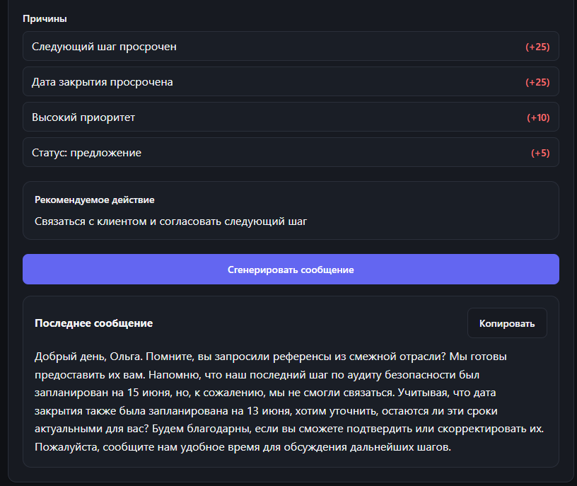
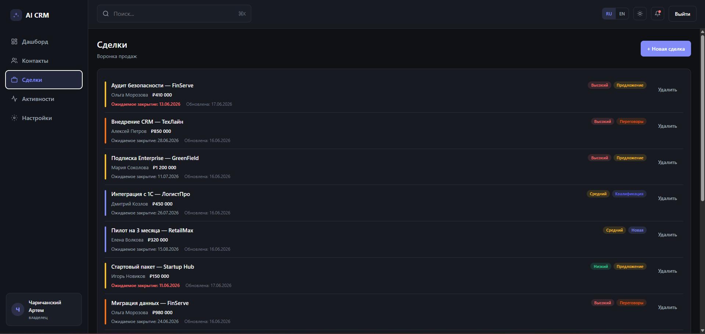

# AI CRM Assistant

**CRM для менеджеров продаж с rule-based анализом риска и AI follow-up.**

Не просто таблица сделок — система подсказывает, **что сорвётся**, **почему** и **что сделать сегодня**: просроченные действия, сделки в зоне риска, готовые сообщения клиенту.

<p align="center">
  
</p>

---

## Описание

AI CRM Assistant — это SaaS-воронка продаж для небольших команд: контакты, сделки, активности и дашборд «что делать сегодня» в одном интерфейсе.

### Что уже умеет продукт

| Модуль | Возможности |
|--------|-------------|
| **CRM** | Контакты, сделки, активности, воронка стадий, next action |
| **Дашборд** | KPI, «Сегодня», следующие действия, сделки в зоне риска, AI-инсайты |
| **Risk Engine** | Rule-based оценка риска 0–100, причины с весами, рекомендуемое действие |
| **AI Follow-up** | Генерация сообщения клиенту через Groq (LLM) на основе сделки и активностей |
| **Поиск** | Глобальный поиск по организации, контактам, сделкам, активностям (⌘K) |
| **i18n** | Русский и английский интерфейс |

### Для кого

- Менеджеры, которым нужен **фокус на действиях**, а не на отчётах
- Команды, которые хотят **ранний сигнал** по сделкам без сложной аналитики
- Проекты, где AI используется **точечно** — follow-up и подсказки, а не «чёрный ящик»

---

## Архитектура

Монорепозиторий: React-фронтенд (FSD) + FastAPI-бэкенд + PostgreSQL.



### Структура репозитория

```
.
├── frontend/                 # React 19 + Vite + TypeScript (FSD)
│   └── src/
│       ├── app/              # Роутинг, провайдеры, store
│       ├── pages/            # Страницы
│       ├── widgets/          # Композитные блоки (layout, header)
│       ├── features/         # Сценарии: дашборд, риск, follow-up
│       ├── entities/         # Сущности: deal, contact, deal-risk
│       └── shared/           # UI-kit, API, i18n
├── backend/
│   └── app/
│       ├── api/routes/       # REST endpoints
│       ├── models/           # SQLAlchemy модели
│       ├── services/         # Бизнес-логика (risk, dashboard, AI)
│       └── schemas/          # Pydantic DTO
├── docker-compose.yml
└── docs/screenshots/         # Скриншоты для README
```

### Ключевые потоки данных

1. **Риск сделки** — считается на лету в `deal_risk_service` при открытии сделки / дашборда (без сохранения в БД на MVP).
2. **Дашборд** — `dashboard_service` агрегирует риски, next actions и топ сделок одним запросом `/api/dashboard/summary`.
3. **AI Follow-up** — `ai_service` собирает контекст сделки → промпт → Groq → сохранение в `ai_followups`.

---

## Стек

### Frontend

| Технология | Назначение |
|------------|------------|
| React 19 | UI |
| TypeScript | Типизация |
| Vite 8 | Сборка и dev-сервер |
| React Router 7 | Маршрутизация |
| Redux Toolkit | Состояние (сделка, auth) |
| CSS Modules | Стили |
| FSD | Архитектура фронтенда |

### Backend

| Технология | Назначение |
|------------|------------|
| FastAPI | REST API |
| SQLAlchemy 2 | ORM |
| Alembic | Миграции |
| PostgreSQL 17 | БД |
| PyJWT + bcrypt | Аутентификация |
| OpenAI SDK | Клиент для Groq API |
| Pydantic Settings | Конфигурация |

### Инфраструктура

| Технология | Назначение |
|------------|------------|
| Docker Compose | Локальный и prod-like запуск |
| Nginx | Статика + proxy `/api` → backend |

---

## Скриншоты

| Дашборд | Карточка сделки |
|:-------:|:---------------:|
|  |  |

| Риск и follow-up | Воронка сделок |
|:----------------:|:--------------:|
|  |  |

---

## Локальный запуск

### Требования

- **Node.js** 20+
- **Yarn** (`npm install -g yarn`)
- **Python** 3.11+
- **PostgreSQL** 17 (локально или через Docker только для БД)

### 1. База данных

```bash
# Вариант A: только Postgres в Docker
docker compose up -d postgres
```

Создайте БД `aiSaas` или используйте настройки из `docker-compose.yml`.

### 2. Backend

```bash
cd backend
python -m venv .venv

# Windows
.venv\Scripts\activate
# macOS / Linux
source .venv/bin/activate

pip install -r requirements.txt
cp .env.example .env
```

Заполните в `backend/.env`:

- `DB_HOST`, `DB_PASSWORD` — доступ к PostgreSQL
- `JWT_SECRET_KEY` — произвольная длинная строка
- `GROQ_API_KEY` — для AI follow-up ([console.groq.com](https://console.groq.com))

```bash
alembic upgrade head
uvicorn app.main:app --reload --port 8000
```

| URL | Описание |
|-----|----------|
| http://localhost:8000/docs | Swagger UI |
| http://localhost:8000/api/health | Health check |

**Демо-данные (опционально):**

```bash
.venv\Scripts\python scripts\seed_demo_data.py
```

### 3. Frontend

```bash
cd frontend
yarn
cp .env.example .env
yarn dev
```

Приложение: **http://localhost:5173**

Vite проксирует `/api` на `http://localhost:8000` — отдельный `VITE_API_URL` для dev не обязателен.

### Первый вход

1. Зарегистрируйтесь → создайте организацию
2. Добавьте контакт → сделку → активность
3. Откройте дашборд и карточку сделки — риск и follow-up появятся автоматически

---

## Docker-запуск

Полный стек одной командой: PostgreSQL + API + фронт с nginx.

```bash
cp backend/.env.example backend/.env
# Заполните JWT_SECRET_KEY, DB_PASSWORD, GROQ_API_KEY

cp frontend/.env.example frontend/.env
# Для compose обычно достаточно: VITE_API_URL=/api

docker compose up -d --build
```

| Сервис | URL |
|--------|-----|
| Frontend | http://localhost:3000 |
| Backend (напрямую) | http://localhost:8000 |
| API через nginx | http://localhost:3000/api/... |

Миграции внутри контейнера backend:

```bash
docker compose exec backend alembic upgrade head
```

Пересборка только фронта после смены `VITE_API_URL`:

```bash
docker compose up -d --build frontend
```

### Переменные окружения

| Файл | Когда читается | Назначение |
|------|----------------|------------|
| `backend/.env` | Runtime API | БД, JWT, CORS, Groq |
| `frontend/.env` | **Build time** | `VITE_API_URL` в JS-бандле |
| `.env` (корень) | `docker compose build` | Опциональный override `VITE_API_URL` |

---

## Roadmap

### ✅ Сделано (MVP)

- [x] Auth: регистрация, JWT, refresh, организации
- [x] CRM: контакты, сделки, активности, воронка
- [x] Rule-based Risk Engine + UI в сделке и на дашборде
- [x] AI Follow-up (Groq)
- [x] Дашборд «что делать сегодня»: next actions, риски, инсайты
- [x] Глобальный поиск, i18n (ru/en), Docker Compose

### 🔜 Ближайшие шаги

- [ ] LLM-объяснение причин риска (красивый текст поверх rule engine)
- [ ] Сохранение `risk_score` в `ai_insights` + история изменений
- [ ] Сброс пароля и email-уведомления
- [ ] Фильтры и сортировка в списке сделок
- [ ] Тесты для `deal_risk_service` и критичных API

### 🧭 Дальше

- [ ] Прогноз вероятности закрытия (ML)
- [ ] Веса риска по индустриям / кастомные правила
- [ ] Командные роли и назначение ответственных
- [ ] Интеграции: Telegram, email, календарь
- [ ] Мобильная адаптация и PWA

---

## API (кратко)

Префикс: `/api`

| Группа | Примеры |
|--------|---------|
| Auth | `POST /auth/register`, `POST /auth/login`, `GET /auth/me` |
| CRM | `GET/POST /contacts`, `GET/PATCH /deals/{id}` |
| Risk | `GET /deals/{id}/risk`, `GET /dashboard/summary` |
| AI | `POST /ai/followups/generate` |
| Search | `GET /search?q=...` |

Полная документация: **http://localhost:8000/docs**

---

## Лицензия

Проект в активной разработке. Лицензия будет указана отдельно.

---

<p align="center">
  <sub>AI CRM Assistant — продажи под контролем, а не под скроллом</sub>
</p>
